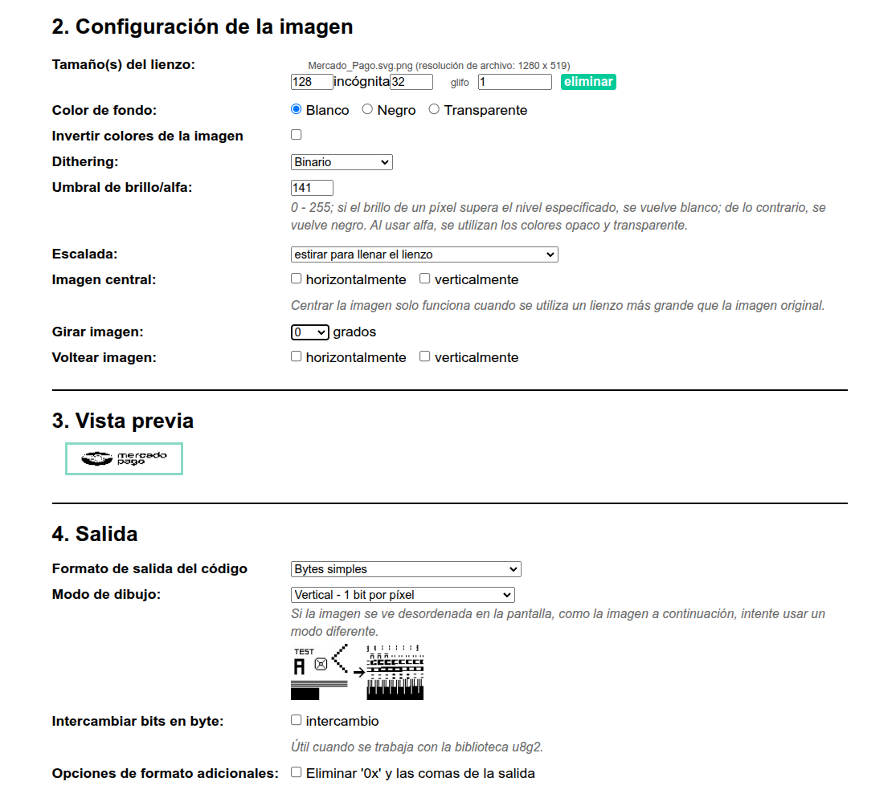

qmk compile -kb sofle_choc -km jdiazaltamir_choc_sofle

qmk flash -kb sofle_choc -km jdiazaltamir_choc_sofle

```
LAYOUT(
    XXXXXXX,  XXXXXXX,  XXXXXXX,  XXXXXXX,  XXXXXXX,  XXXXXXX,                         XXXXXXX,  XXXXXXX,  XXXXXXX,  XXXXXXX,  XXXXXXX,  XXXXXXX,
    XXXXXXX,  XXXXXXX,  XXXXXXX,  XXXXXXX,  XXXXXXX,  XXXXXXX,                         XXXXXXX,  XXXXXXX,  XXXXXXX,  XXXXXXX,  XXXXXXX,  XXXXXXX,
    XXXXXXX,  XXXXXXX,  XXXXXXX,  XXXXXXX,  XXXXXXX,  XXXXXXX,                         XXXXXXX,  XXXXXXX,  XXXXXXX,  XXXXXXX,  XXXXXXX,  XXXXXXX,
    XXXXXXX,  XXXXXXX,  XXXXXXX,  XXXXXXX,  XXXXXXX,  XXXXXXX,  XXXXXXX,     XXXXXXX,  XXXXXXX,  XXXXXXX,  XXXXXXX,  XXXXXXX,  XXXXXXX,  XXXXXXX,
                   XXXXXXX,  XXXXXXX,  XXXXXXX,  XXXXXXX,  XXXXXXX,                 XXXXXXX,  XXXXXXX,  XXXXXXX,  |
)
};
```

https://joric.github.io/qle/


// static void print_status_2(void) {
//     oled_set_cursor(0,1);
    
//     oled_write_ln_P(PSTR("Getsemani <3"), false);

//     oled_write_ln_P(PSTR("-----"), false);
//     oled_write_ln_P(PSTR("(=^_^=)"), false);

// }

// static void render_logo(void) {
//     static const char PROGMEM qmk_logo[] = {
//         0x80, 0x81, 0x82, 0x83, 0x84, 0x85, 0x86, 0x87, 0x88, 0x89, 0x8A, 0x8B, 0x8C, 0x8D, 0x8E, 0x8F, 0x90, 0x91, 0x92, 0x93, 0x94,
//         0xA0, 0xA1, 0xA2, 0xA3, 0xA4, 0xA5, 0xA6, 0xA7, 0xA8, 0xA9, 0xAA, 0xAB, 0xAC, 0xAD, 0xAE, 0xAF, 0xB0, 0xB1, 0xB2, 0xB3, 0xB4,
//         0xC0, 0xC1, 0xC2, 0xC3, 0xC4, 0xC5, 0xC6, 0xC7, 0xC8, 0xC9, 0xCA, 0xCB, 0xCC, 0xCD, 0xCE, 0xCF, 0xD0, 0xD1, 0xD2, 0xD3, 0xD4, 0x00
//     };

//     oled_write_P(qmk_logo, false);
// }

// // Test: relleno para 128x32 (128 * 4 pages = 512 bytes), pone todo blanco
// static void oled_test_128x32(void) {
//     static const char PROGMEM oled_test_buf_128x32[128 * 4] = { [0 ... (128*4 - 1)] = 0xFF }; // todo a 1
//     oled_write_raw_P(oled_test_buf_128x32, sizeof(oled_test_buf_128x32));
// }

// Test: escribe líneas numeradas para contar cuántas caben en la pantalla
// static void oled_test_lines(void) {
//     oled_clear();
//     // Imprime hasta 8 líneas (cada línea ≈ 8 px de alto)
//     oled_write_ln("Line 1", false);
//     oled_write_ln("Line 2", false);
//     oled_write_ln("Line 3", false);
//     oled_write_ln("Line 4", false);// solo caben 4 porqu ela resolucion es 128x32

// }


// static void render_logo_dog_sit(void) {
//     static const char PROGMEM raw_logo[] = {
//         0x00, 0x00, 0x00, 0x00, 0x00, 0x00, 0x00, 0x00, 0x00, 0x00, 0x00, 0x00, 0x00, 0x00, 0xe0, 0x1c, 0x02, 0x05, 0x02, 0x24, 0x04, 0x04, 0x02, 0xa9, 0x1e, 0xe0, 0x00, 0x00, 0x00, 0x00, 0x00, 0x00,
//         0x00, 0x00, 0x00, 0x00, 0x00, 0xe0, 0x90, 0x08, 0x18, 0x60, 0x10, 0x08, 0x04, 0x03, 0x00, 0x00, 0x00, 0x00, 0x00, 0x00, 0x00, 0x02, 0x0e, 0x82, 0x7c, 0x03, 0x00, 0x00, 0x00, 0x00, 0x00, 0x00,
//         0x00, 0x00, 0x00, 0x00, 0x00, 0x00, 0x01, 0x02, 0x04, 0x0c, 0x10, 0x10, 0x20, 0x20, 0x20, 0x28, 0x3e, 0x1c, 0x20, 0x20, 0x3e, 0x0f, 0x11, 0x1f, 0x00, 0x00, 0x00, 0x00, 0x00, 0x00, 0x00, 0x00
//     };
//     oled_write_raw_P(raw_logo, sizeof(raw_logo));
// }


// static void render_logo_mp(void) { // MP fondo blanco 1, oled a 0 grados
//     static const char PROGMEM raw_logo[] = {
//         // 'Mercado_Pago', 128x32px
//         0xff, 0xff, 0xff, 0xff, 0xff, 0xff, 0xff, 0xff, 0xff, 0xff, 0xff, 0xff, 0xff, 0xff, 0xff, 0xff, 
//         0xff, 0xff, 0xff, 0xff, 0xff, 0xff, 0xff, 0xff, 0xff, 0xff, 0xff, 0xff, 0xff, 0xff, 0xff, 0xff, 
//         0xff, 0xff, 0xff, 0xff, 0xff, 0xff, 0xff, 0xff, 0xff, 0xff, 0xff, 0xff, 0xff, 0xff, 0xff, 0xff, 
//         0xff, 0xff, 0xff, 0xff, 0xff, 0xff, 0xff, 0xff, 0xff, 0xff, 0xff, 0xff, 0xff, 0xff, 0xff, 0xff, 
//         0xff, 0xff, 0xff, 0xff, 0xff, 0xff, 0xff, 0xff, 0xff, 0xff, 0xff, 0xff, 0xff, 0xff, 0xff, 0xff, 
//         0xff, 0xff, 0xff, 0xff, 0xff, 0xff, 0xff, 0xff, 0xff, 0xff, 0xff, 0xff, 0xff, 0xff, 0xff, 0xff, 
//         0xff, 0xff, 0xff, 0xff, 0xff, 0xff, 0xff, 0xff, 0xff, 0xff, 0xff, 0xff, 0xff, 0xff, 0xff, 0xff, 
//         0xff, 0xff, 0xff, 0xff, 0xff, 0xff, 0xff, 0xff, 0xff, 0xff, 0xff, 0xff, 0xff, 0xff, 0xff, 0xff, 
//         0xff, 0xff, 0xff, 0xff, 0xff, 0xff, 0xff, 0xff, 0xff, 0xff, 0xff, 0xff, 0xff, 0xff, 0xff, 0xff, 
//         0x3f, 0x5f, 0x7f, 0x77, 0x7f, 0xf3, 0xf3, 0xf3, 0xf1, 0xf1, 0xf1, 0xd1, 0xe1, 0xe1, 0xf1, 0xd8, 
//         0xf8, 0xe8, 0xe8, 0xe8, 0xf9, 0xd1, 0xb1, 0xb1, 0x71, 0xf1, 0xf1, 0xf3, 0xf3, 0xf3, 0x77, 0x77, 
//         0x7f, 0x7f, 0x7f, 0xff, 0xff, 0xff, 0xff, 0xff, 0x8f, 0x83, 0xf3, 0xfb, 0xfb, 0x83, 0x83, 0xfb, 
//         0xfb, 0xc3, 0x87, 0xff, 0xc7, 0xc3, 0xab, 0xab, 0xab, 0xa3, 0xe7, 0xff, 0xdf, 0x87, 0xf3, 0xfb, 
//         0xfb, 0xc7, 0x83, 0x93, 0xbb, 0xbb, 0x93, 0xd3, 0xff, 0xdf, 0x83, 0xab, 0xab, 0xab, 0x83, 0xc7, 
//         0xef, 0xc7, 0x93, 0xbb, 0xbb, 0x93, 0xc1, 0xc1, 0xef, 0xc7, 0x93, 0xbb, 0xbb, 0xbb, 0x83, 0xc7, 
//         0xff, 0xff, 0xff, 0xff, 0xff, 0xff, 0xff, 0xff, 0xff, 0xff, 0xff, 0xff, 0xff, 0xff, 0xff, 0xff, 
//         0xff, 0xff, 0xff, 0xff, 0xff, 0xff, 0xff, 0xff, 0xff, 0xff, 0xff, 0xff, 0xff, 0xff, 0xff, 0xff, 
//         0xfc, 0xf8, 0xf0, 0xe0, 0xe0, 0xc0, 0xc0, 0xc0, 0x80, 0x83, 0x82, 0x86, 0x86, 0x87, 0x87, 0x0d, 
//         0x0f, 0x0b, 0x0f, 0x0f, 0x87, 0x8f, 0x86, 0x87, 0x85, 0x83, 0x82, 0xc0, 0xc0, 0xc0, 0xe0, 0xe0, 
//         0xf0, 0xf8, 0xfc, 0xff, 0xff, 0xff, 0xff, 0xff, 0x83, 0x81, 0xe9, 0xdd, 0xdd, 0xcd, 0xe1, 0xf3, 
//         0xef, 0xc5, 0xd5, 0xd5, 0xcd, 0xe1, 0xe1, 0xff, 0xa1, 0xa1, 0x0d, 0x1d, 0xad, 0x81, 0xc3, 0xff, 
//         0xe1, 0xe1, 0xcd, 0xdd, 0xcd, 0xe1, 0xe3, 0xff, 0xff, 0xff, 0xff, 0xff, 0xff, 0xff, 0xff, 0xff, 
//         0xff, 0xff, 0xff, 0xff, 0xff, 0xff, 0xff, 0xff, 0xff, 0xff, 0xff, 0xff, 0xff, 0xff, 0xff, 0xff, 
//         0xff, 0xff, 0xff, 0xff, 0xff, 0xff, 0xff, 0xff, 0xff, 0xff, 0xff, 0xff, 0xff, 0xff, 0xff, 0xff, 
//         0xff, 0xff, 0xff, 0xff, 0xff, 0xff, 0xff, 0xff, 0xff, 0xff, 0xff, 0xff, 0xff, 0xff, 0xff, 0xff, 
//         0xff, 0xff, 0xff, 0xff, 0xff, 0xff, 0xff, 0xff, 0xff, 0xff, 0xff, 0xff, 0xff, 0xff, 0xff, 0xff, 
//         0xff, 0xff, 0xff, 0xff, 0xff, 0xff, 0xff, 0xff, 0xff, 0xff, 0xff, 0xff, 0xff, 0xff, 0xff, 0xff, 
//         0xff, 0xff, 0xff, 0xff, 0xff, 0xff, 0xff, 0xff, 0xff, 0xff, 0xff, 0xff, 0xff, 0xff, 0xff, 0xff, 
//         0xff, 0xff, 0xff, 0xff, 0xff, 0xff, 0xff, 0xff, 0xff, 0xff, 0xff, 0xff, 0xff, 0xff, 0xff, 0xff, 
//         0xff, 0xff, 0xff, 0xff, 0xff, 0xff, 0xff, 0xff, 0xff, 0xff, 0xff, 0xff, 0xff, 0xff, 0xff, 0xff, 
//         0xff, 0xff, 0xff, 0xff, 0xff, 0xff, 0xff, 0xff, 0xff, 0xff, 0xff, 0xff, 0xff, 0xff, 0xff, 0xff, 
//         0xff, 0xff, 0xff, 0xff, 0xff, 0xff, 0xff, 0xff, 0xff, 0xff, 0xff, 0xff, 0xff, 0xff, 0xff, 0xff
//     };
//     oled_write_raw_P(raw_logo, sizeof(raw_logo));
// }


// static void render_logo_mp(void) { // MP fondo negro 1, oled a 0 grados
//     static const char PROGMEM raw_logo[] = {
//     // 'Mercado_Pago', 128x32px
//     0x00, 0x00, 0x00, 0x00, 0x00, 0x00, 0x00, 0x00, 0x00, 0x00, 0x00, 0x00, 0x00, 0x00, 0x00, 0x00, 
//     0x00, 0x00, 0x00, 0x00, 0x00, 0x00, 0x00, 0x00, 0x00, 0x00, 0x00, 0x00, 0x00, 0x00, 0x00, 0x00, 
//     0x00, 0x00, 0x00, 0x00, 0x00, 0x00, 0x00, 0x00, 0x00, 0x00, 0x00, 0x00, 0x00, 0x00, 0x00, 0x00, 
//     0x00, 0x00, 0x00, 0x00, 0x00, 0x00, 0x00, 0x00, 0x00, 0x00, 0x00, 0x00, 0x00, 0x00, 0x00, 0x00, 
//     0x00, 0x00, 0x00, 0x00, 0x00, 0x00, 0x00, 0x00, 0x00, 0x00, 0x00, 0x00, 0x00, 0x00, 0x00, 0x00, 
//     0x00, 0x00, 0x00, 0x00, 0x00, 0x00, 0x00, 0x00, 0x00, 0x00, 0x00, 0x00, 0x00, 0x00, 0x00, 0x00, 
//     0x00, 0x00, 0x00, 0x00, 0x00, 0x00, 0x00, 0x00, 0x00, 0x00, 0x00, 0x00, 0x00, 0x00, 0x00, 0x00, 
//     0x00, 0x00, 0x00, 0x00, 0x00, 0x00, 0x00, 0x00, 0x00, 0x00, 0x00, 0x00, 0x00, 0x00, 0x00, 0x00, 
//     0x00, 0x00, 0x00, 0x00, 0x00, 0x00, 0x00, 0x00, 0x00, 0x00, 0x00, 0x00, 0x00, 0x00, 0x00, 0x00, 
//     0xc0, 0xa0, 0x80, 0x88, 0x80, 0x8c, 0x0c, 0x0c, 0x0e, 0x0e, 0x0e, 0x2e, 0x1e, 0x1e, 0x0e, 0x27, 
//     0x07, 0x17, 0x17, 0x17, 0x06, 0x2e, 0x4e, 0x4e, 0x8e, 0x0e, 0x0e, 0x0c, 0x0c, 0x0c, 0x88, 0x88, 
//     0x80, 0x80, 0x80, 0x00, 0x00, 0x00, 0x00, 0x00, 0x70, 0x7c, 0x0c, 0x04, 0x04, 0x7c, 0x7c, 0x04, 
//     0x04, 0x7c, 0x78, 0x00, 0x38, 0x3c, 0x54, 0x54, 0x54, 0x5c, 0x18, 0x10, 0x70, 0x78, 0x0c, 0x04, 
//     0x04, 0x38, 0x7c, 0x6c, 0x44, 0x44, 0x6c, 0x2c, 0x00, 0x20, 0x7c, 0x54, 0x54, 0x54, 0x7c, 0x38, 
//     0x10, 0x38, 0x6c, 0x44, 0x44, 0x6c, 0x3e, 0x3e, 0x10, 0x38, 0x6c, 0x44, 0x44, 0x64, 0x7c, 0x38, 
//     0x00, 0x00, 0x00, 0x00, 0x00, 0x00, 0x00, 0x00, 0x00, 0x00, 0x00, 0x00, 0x00, 0x00, 0x00, 0x00, 
//     0x00, 0x00, 0x00, 0x00, 0x00, 0x00, 0x00, 0x00, 0x00, 0x00, 0x00, 0x00, 0x00, 0x00, 0x00, 0x00, 
//     0x03, 0x07, 0x0f, 0x1f, 0x1f, 0x3f, 0x3f, 0x3f, 0x7f, 0x7d, 0x7d, 0x79, 0x79, 0x78, 0x78, 0xf2, 
//     0xf0, 0xf4, 0xf0, 0xf0, 0x78, 0x70, 0x79, 0x78, 0x7a, 0x7c, 0x7d, 0x3f, 0x3f, 0x3f, 0x1f, 0x1f, 
//     0x0f, 0x07, 0x03, 0x00, 0x00, 0x00, 0x00, 0x00, 0x7c, 0x7e, 0x36, 0x22, 0x22, 0x32, 0x1e, 0x0c, 
//     0x10, 0x3a, 0x2a, 0x2a, 0x32, 0x1e, 0x1e, 0x00, 0x5e, 0x5e, 0xf2, 0xe2, 0x52, 0x7e, 0x3c, 0x08, 
//     0x1e, 0x1e, 0x32, 0x22, 0x32, 0x1e, 0x1c, 0x00, 0x00, 0x00, 0x00, 0x00, 0x00, 0x00, 0x00, 0x00, 
//     0x00, 0x00, 0x00, 0x00, 0x00, 0x00, 0x00, 0x00, 0x00, 0x00, 0x00, 0x00, 0x00, 0x00, 0x00, 0x00, 
//     0x00, 0x00, 0x00, 0x00, 0x00, 0x00, 0x00, 0x00, 0x00, 0x00, 0x00, 0x00, 0x00, 0x00, 0x00, 0x00, 
//     0x00, 0x00, 0x00, 0x00, 0x00, 0x00, 0x00, 0x00, 0x00, 0x00, 0x00, 0x00, 0x00, 0x00, 0x00, 0x00, 
//     0x00, 0x00, 0x00, 0x00, 0x00, 0x00, 0x00, 0x00, 0x00, 0x00, 0x00, 0x00, 0x00, 0x00, 0x00, 0x00, 
//     0x00, 0x00, 0x00, 0x00, 0x00, 0x00, 0x00, 0x00, 0x00, 0x00, 0x00, 0x00, 0x00, 0x00, 0x00, 0x00, 
//     0x00, 0x00, 0x00, 0x00, 0x00, 0x00, 0x00, 0x00, 0x00, 0x00, 0x00, 0x00, 0x00, 0x00, 0x00, 0x00, 
//     0x00, 0x00, 0x00, 0x00, 0x00, 0x00, 0x00, 0x00, 0x00, 0x00, 0x00, 0x00, 0x00, 0x00, 0x00, 0x00, 
//     0x00, 0x00, 0x00, 0x00, 0x00, 0x00, 0x00, 0x00, 0x00, 0x00, 0x00, 0x00, 0x00, 0x00, 0x00, 0x00, 
//     0x00, 0x00, 0x00, 0x00, 0x00, 0x00, 0x00, 0x00, 0x00, 0x00, 0x00, 0x00, 0x00, 0x00, 0x00, 0x00, 
//     0x00, 0x00, 0x00, 0x00, 0x00, 0x00, 0x00, 0x00, 0x00, 0x00, 0x00, 0x00, 0x00, 0x00, 0x00, 0x00
//     };
//     oled_write_raw_P(raw_logo, sizeof(raw_logo));
// }
https://javl.github.io/image2cpp/


